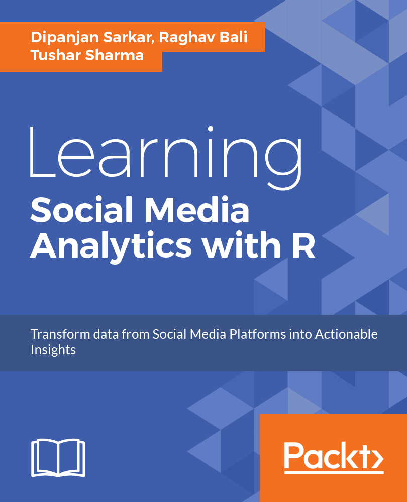

# Learning Social Media Analytics with R
### A Practical Real-World Approach to Gaining Actionable Insights from your Data

Text analytics can be a bit overwhelming and frustrating at times
with the unstructured and noisy nature of textual data and the 
vast amount of information available. 
"Text Analytics with Python" is a book packed with 385 pages of useful information 
based on techniques, algorithms, experiences and various lessons learnt over time 
in analyzing text data. This repository contains datasets and code used in this book.
I will also be adding various notebooks and bonus content here from time to time. 
Keep watching this space!

## Get the book 
TBA
  

## About the book 

The Internet has truly become humongous, especially with the rise of various forms of social media in the last decade, which give users a platform to express themselves and also communicate and collaborate with each other. This book will help the reader to understand the current social media landscape and to learn how analytics can be leveraged to derive insights from it. This data can be analyzed to gain valuable insights into the behavior and engagement of users, organizations, businesses, and brands. It will help readers frame business problems and solve them using social data.

The book will also cover several practical real-world use cases on social media using R and its advanced packages to utilize data science methodologies such as sentiment analysis, topic modeling, text summarization, recommendation systems, social network analysis, classification, and clustering. This will enable readers to learn different hands-on approaches to obtain data from diverse social media sources such as Twitter and Facebook. It will also show readers how to establish detailed workflows to process, visualize, and analyze data to transform social data into actionable insights.

Edition: 1st &emsp; Pages: 394 &emsp; Language: English 
Book Title: Learning Social Media Analytics with R &emsp; Publisher: Packt  
Copyright: Sarkar, Bali & Sharma &emsp; ISBN 13: 9781787127524 

 

Key Features:
 - A practical guide written to help leverage the power of the R eco-system to extract, process, analyze, visualize and model social media data
 - Learn about data access, retrieval, cleaning, and curation methods for data originating from various social media platforms.
 - Visualize and analyze data from social media platforms to understand and model complex relationships using various concepts and techniques such as Sentiment Analysis, Topic Modeling, Text Summarization, Recommendation Systems, Social Network Analysis, Classification, and Clustering.

 

What You Will Learn:
 - Learn how to tap into data from diverse social media platforms using the R ecosystem
 - Use social media data to formulate and solve real-world problems
 - Analyze user social networks and communities using concepts from graph theory and network analysis
 - Learn to detect opinion and sentiment, extract themes, topics, and trends from unstructured noisy text data from diverse social media channels
 - Understand the art of representing actionable insights with effective visualizations
 - Analyze data from major social media channels such as Twitter, Facebook, Flickr, Foursquare, Github, StackExchange, and so on
 - Learn to leverage popular R packages such as `ggplot2`, `topicmodels`, `caret`, `e1071`, `tm`, `wordcloud`, `twittR`, `Rfacebook`, `dplyr`, `reshape2`, and many more